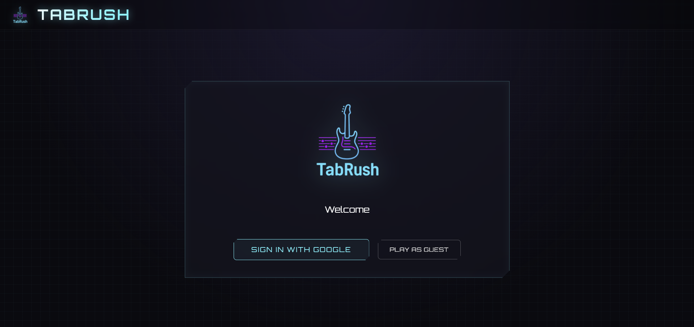
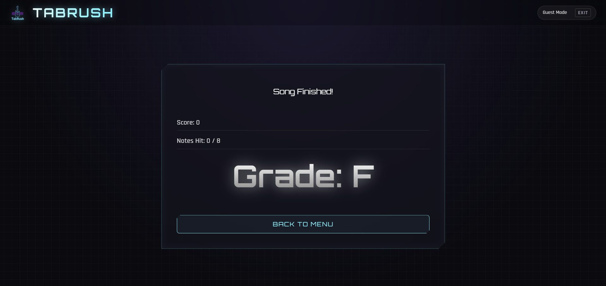
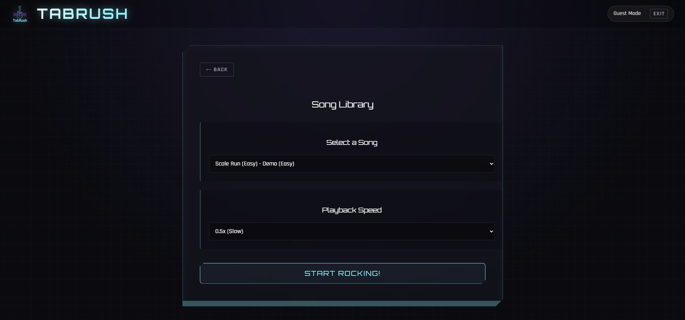
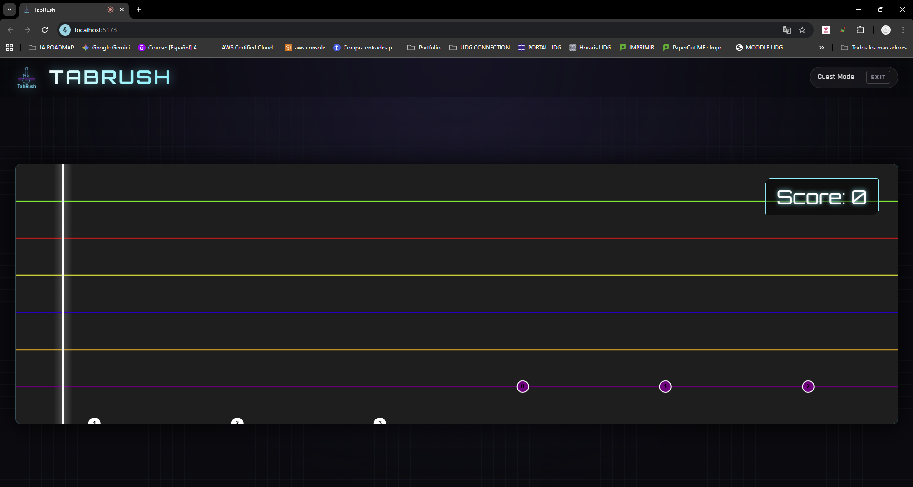
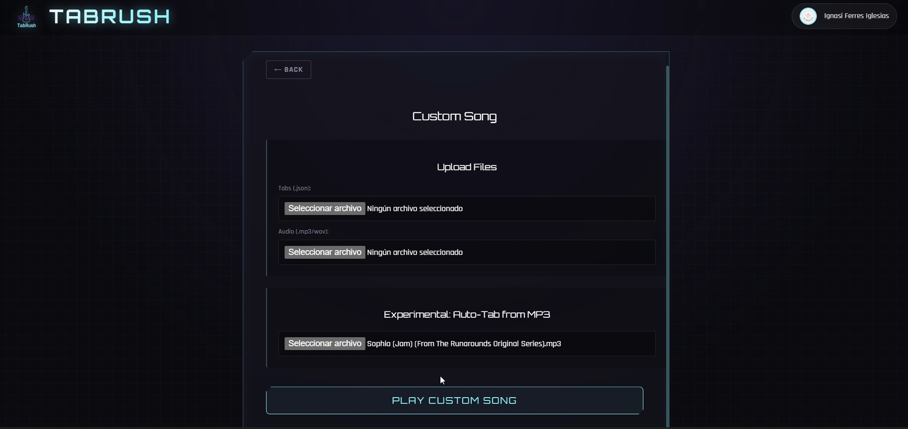
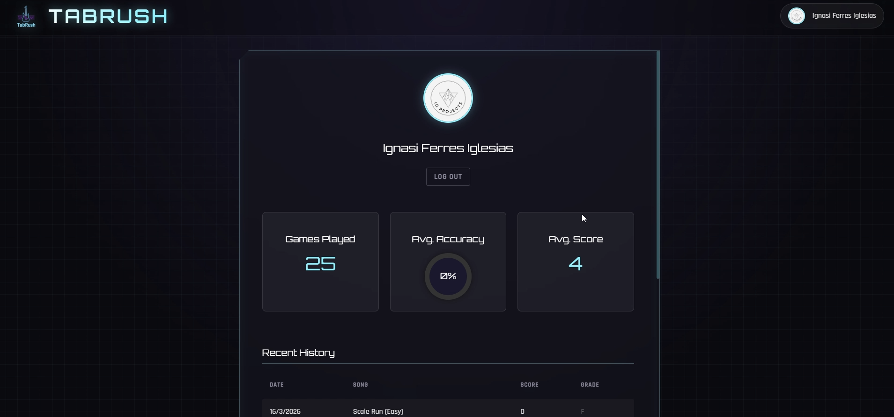

# ⚡ TabRush · Gestión Inteligente de Productividad

**TabRush** es una aplicación multiplataforma de alto rendimiento diseñada para optimizar el flujo de trabajo digital. Más que un simple organizador, es un ecosistema de productividad que permite a los usuarios capturar, organizar y sincronizar información crítica en tiempo real entre entornos web y dispositivos móviles.

La aplicación nace de la necesidad de centralizar la información en un mundo digital saturado, utilizando un stack tecnológico moderno que garantiza velocidad, escalabilidad y una experiencia de usuario premium.

---

## 🚀 Stack Tecnológico


---

## ✨ Características Principales

* **Sincronización en Tiempo Real:** Implementación de **Firebase Firestore** para asegurar que cada acción (crear, editar o eliminar) se refleje instantáneamente en todos los dispositivos conectados.
* **Arquitectura Híbrida (Web + Mobile):** Gracias a **Capacitor**, la aplicación se despliega de forma nativa en **iOS**, compartiendo la lógica de negocio y el frontend de React para un mantenimiento eficiente.
* **Seguridad y Autenticación:** Integración total con **Firebase Auth**, permitiendo un acceso seguro y personalizado para cada usuario.
* **Velocidad de Desarrollo y Carga:** Optimizado con **Vite**, logrando tiempos de compilación mínimos y una carga de página extremadamente rápida gracias al renderizado eficiente de React.
* **Gestión de Datos Escalable:** Estructura de datos optimizada para soportar grandes volúmenes de información sin comprometer la latencia de la aplicación.

---

## 📸 Galería de la Aplicación

Explora la interfaz y las funcionalidades principales de TabRush:

### 🖥️ Dashboard y Gestión de Datos
| Vista Principal | Organización de Contenido |
| :---: | :---: |
|  |  |

### 🛠️ Herramientas de Edición y Control
| Detalle de Pestañas | Edición de Información |
| :---: | :---: |
|  |  |

### 📱 Perfil y Sincronización Móvil
| Gestión de Perfil | Ajustes de Sistema |
| :---: | :---: |
|  |  |

---

## 🛠️ Instalación y Configuración Local

Sigue estos pasos para poner en marcha el proyecto en tu máquina local:

1.  **Clonar el repositorio:**
    ```bash
    git clone [https://github.com/IGprojects/TabRush.git](https://github.com/IGprojects/TabRush.git)
    ```

2.  **Instalar dependencias:**
    ```bash
    npm install
    ```

3.  **Configuración de Variables de Entorno:**
    Crea un archivo `.env` en la raíz del proyecto para conectar con tu instancia de Firebase. **Importante:** No compartas este archivo en repositorios públicos.
    ```env
    VITE_FIREBASE_API_KEY=tu_api_key
    VITE_FIREBASE_AUTH_DOMAIN=tu_auth_domain
    VITE_FIREBASE_PROJECT_ID=tu_project_id
    VITE_FIREBASE_STORAGE_BUCKET=tu_storage_bucket
    VITE_FIREBASE_MESSAGING_SENDER_ID=tu_sender_id
    VITE_FIREBASE_APP_ID=tu_app_id
    ```

4.  **Ejecutar en modo desarrollo:**
    ```bash
    npm run dev
    ```

---

## 📂 Estructura del Proyecto

* **`src/components`**: Bloques de construcción de la UI (Modales, formularios, listas).
* **`src/data`**: Lógica de persistencia y modelos de datos.
* **`src/utils`**: Helpers para validaciones y formateo de datos.
* **`ios/`**: Carpeta de proyecto nativo para despliegue en dispositivos Apple.
* **`firebase.js`**: Punto de entrada y configuración de los servicios de Google Firebase.

---

## 🛡️ Seguridad y Buenas Prácticas

La seguridad es el pilar de TabRush. La aplicación implementa:
1.  **Reglas de Seguridad en Firestore:** Los datos solo son accesibles por sus propietarios legítimos.
2.  **Protección de Keys:** Uso estricto de variables de entorno para evitar filtraciones en el código fuente.
3.  **Optimización de Bundle:** Tree-shaking y lazy loading para garantizar que el cliente solo cargue el código estrictamente necesario.

---
**Desarrollado con profesionalismo y pasión por [IGprojects](https://github.com/IGprojects)**
